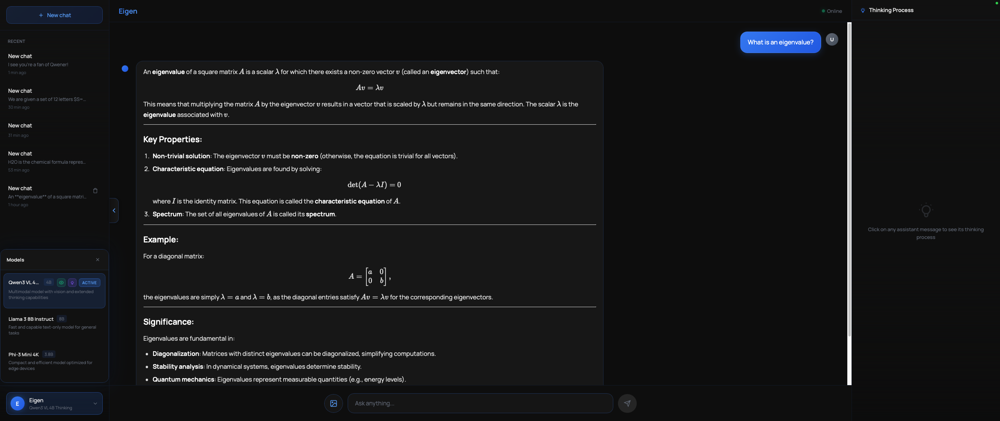

# eigenAgent 🧠⚡

**eigenAgent** is a fully local, desktop AI assistant built with **Rust**, **Tauri**, **React**, and **llama.cpp**.  
It runs quantized GGUF models on-device, streams responses token-by-token, renders Markdown + LaTeX, and cleanly separates *model reasoning* from *final answers*.

No cloud. No API keys. Your data stays on your machine.


---

## ✨ Features

- 🖥️ **Local-first AI** using GGUF models (llama.cpp)
- ⚡ **Token-level streaming** responses
- 🧠 **Hidden chain-of-thought** (`<think>...</think>`) with optional side-panel viewing
- ✍️ **Markdown rendering** (GitHub-flavored)
- 📐 **LaTeX math rendering** via KaTeX
- 💬 **Chat history UI** with assistant / user roles
- 🪟 **Desktop app** via Tauri (macOS / Windows / Linux)
- 🎨 **Custom dark UI** with styled scrollbars
- 🚀 **Non-blocking model load** with startup loading screen

---

## 🧱 Tech Stack

**Backend**
- Rust
- Tauri
- [`llama_cpp_2`](https://crates.io/crates/llama_cpp_2)
- GGUF quantized models (e.g. Qwen, LLaMA)

**Frontend**
- React + TypeScript
- `react-markdown`
- `remark-gfm`
- `remark-math` + `rehype-katex`
- Custom CSS (no UI framework)

---

## 📂 Project Structure

```
eigenAgent/
├── src-tauri/
│ └── src/
│ └── lib.rs # Rust backend (model loading, streaming, state)
├── src/
│ ├── App.tsx # React UI
│ ├── App.css # UI + scrollbar styling
│ └── main.tsx
├── models/
│ └── *.gguf # Local LLM models (not committed)
└── README.md
```
---

## 🧠 How It Works

1. **Startup**
   - `LlamaBackend` initializes
   - Model loads asynchronously (non-blocking)
   - Frontend listens for `model:ready`

2. **Chat**
   - Frontend sends user prompt (and optional history)
   - Backend formats ChatML-style prompt
   - Tokens are streamed back via Tauri events:
     - `chat:begin`
     - `chat:delta`
     - `chat:end`

3. **Reasoning Control**
   - Model is instructed to wrap internal reasoning in `<think>...</think>`
   - Frontend:
     - hides `<think>` content from the main chat
     - optionally displays it in a side panel

---

## 🧪 Supported Models

Any **GGUF** model compatible with llama.cpp should work.

Recommended:
- Qwen / Qwen3
- LLaMA-family models
- Mistral-family models

Example:
```
Qwen3VL-4B-Thinking-Q4_K_M.gguf
```
> ⚠️ Models are **not** included in the repo.

---

## 🚀 Getting Started

### Prerequisites
- Rust (stable)
- Node.js (18+)
- pnpm / npm / yarn
- Tauri CLI

```bash
cargo install tauri-cli
```

### Install Dependencies
```bash
npm install
```

### Add a model
```
models/
└── your-model.gguf
```
Update the model path in:
```
src-tauri/src/lib.rs
```

### Run the app
```
npm run tauri dev
```